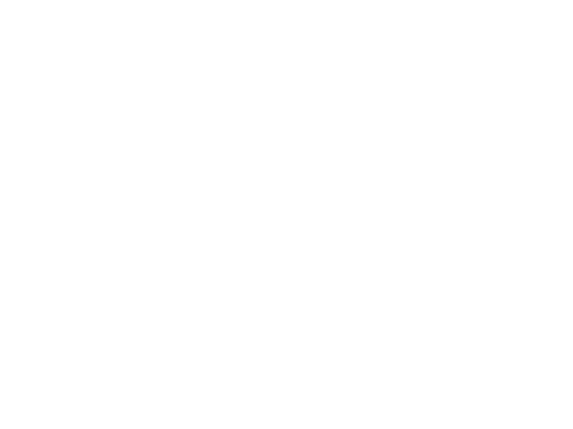

# 🏠 House Price Prediction using Machine Learning

## 📌 Problem

The goal of this project is to predict house prices based on features such as income, house age, and location.

---

## 📊 Dataset

• California Housing Dataset
• 20,640 rows and 8 features

---

## ⚙️ Approach

• Loaded and explored dataset using Pandas
• Performed data analysis and visualization
• Split data into training and testing sets
• Trained a Linear Regression model

---

## 🤖 Model

• Linear Regression

---

## 📊 Results

• Achieved R² Score of ~0.6
• Model shows moderate prediction performance

---

## 🔍 Insights

• Median income has strong impact on house prices
• House age has moderate influence

---

## 🛠️ Tech Stack

• Python
• Pandas, NumPy
• Scikit-learn
• Matplotlib, Seaborn

---

## 📈 Output

### Model Prediction Graph

### R2 Score

### Price Distribution

---

## ▶️ How to Run

1. Install dependencies
2. Run the notebook

---

## 🚀 Learnings

• Understood regression modeling
• Learned data preprocessing and evaluation
• Gained hands-on ML experience
